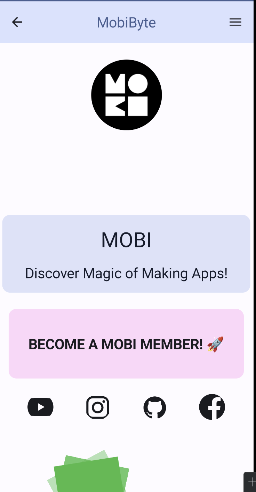
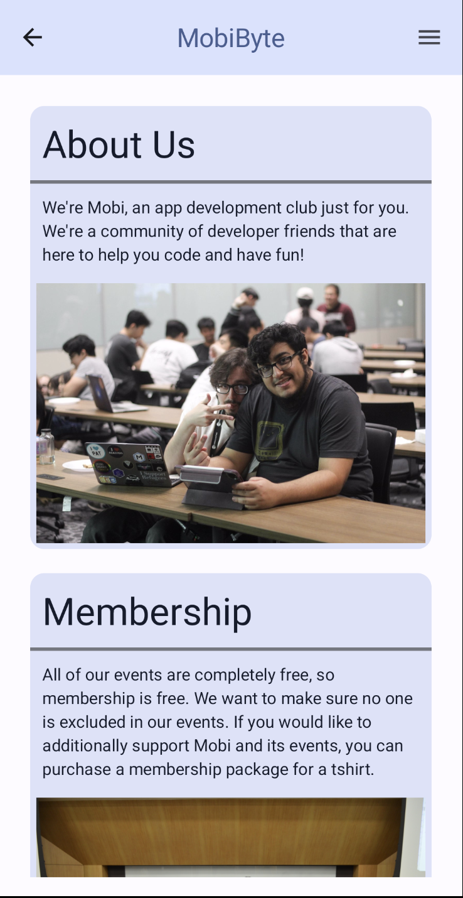
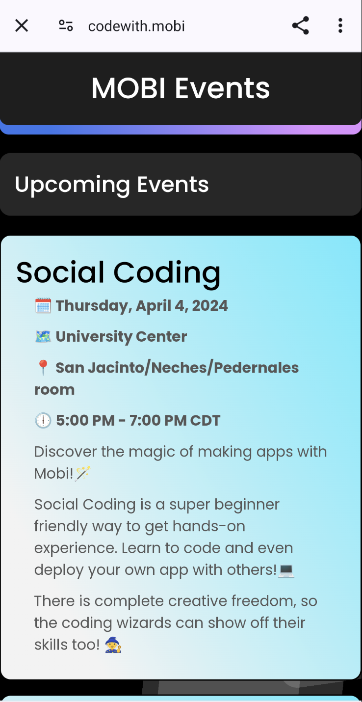
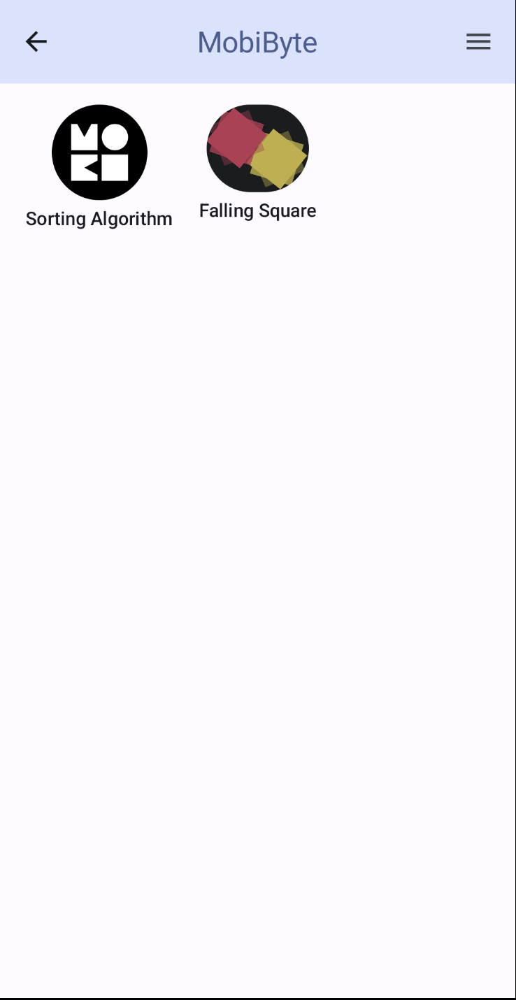

<h1 align="center">
  <a href="https://github.com/mobibyte/social-coding-android">
    <!-- Please provide path to your logo here -->
    
  </a>
</h1>

  Social-Coding(Android)
   
  <a href="#about"><strong>Explore the screenshots »</strong></a>
   
   
  <a href="https://github.com/mobibyte/social-coding-android/issues/new?assignees=&labels=bug&template=01_BUG_REPORT.md&title=bug%3A+">Report a Bug</a>
  ·
  <a href="https://github.com/mobibyte/social-coding-android/issues/new?assignees=&labels=enhancement&template=02_FEATURE_REQUEST.md&title=feat%3A+">Request a Feature</a>
  .
  <a href="https://github.com/mobibyte/social-coding-android/issues/new?assignees=&labels=question&template=04_SUPPORT_QUESTION.md&title=support%3A+">Ask a Question</a>

 

Table of Contents

- [About](#about)
  - [Built With](#built-with)
- [Getting Started](#getting-started)
  - [Prerequisites](#prerequisites)
  - [Installation](#installation)
- [Roadmap](#roadmap)
- [Support](#support)
- [Project assistance](#project-assistance)
- [Contributing](#contributing)
- [Authors & contributors](#authors--contributors)
- [License](#license)

---

## About

<table><tr><td>

> Discover the magic of making mobile apps!
> SocialCodingAndroid is an app where mobimembers can make contributions to and create their own android app within the app.
> It provides information about MOBI, and Event details

Screenshots

 

> **[?]**
> Please provide your screenshots here.

|                               Page 1                                  |                               Page 2                                 |
| :-------------------------------------------------------------------: | :------------------------------------------------------------------: |
|    |  |
|                               Page 3                                  |                               Page 4                                 |
| :-------------------------------------------------------------------: | :------------------------------------------------------------------: |
|    |  |
|                               Page 5                                  | 
| :-------------------------------------------------------------------: | 
|    | 

</td></tr></table>

### Built With

> This app was built with Android Studio Iguana and JetPackCompose

## Getting Started

### Prerequisites

> When you clone this project, Android Studio will take care of all dependencies with the gradel file.
> Android studio iguana: https://developer.android.com/studio/archive

### Installation

> To install the app, look to our releases to see the most recent push of the app.
> We are planning to publish the app on the Google Play Store, but since
> this project is open sourced, it will be more outdated with the addition of apps from MOBI Members.

## Roadmap

See the [open issues](https://github.com/mobibyte/social-coding-android/issues) for a list of proposed features (and known issues).

- [Top Feature Requests](https://github.com/mobibyte/social-coding-android/issues?q=label%3Aenhancement+is%3Aopen+sort%3Areactions-%2B1-desc) (Add your votes using the 👍 reaction)
- [Top Bugs](https://github.com/mobibyte/social-coding-android/issues?q=is%3Aissue+is%3Aopen+label%3Abug+sort%3Areactions-%2B1-desc) (Add your votes using the 👍 reaction)
- [Newest Bugs](https://github.com/mobibyte/social-coding-android/issues?q=is%3Aopen+is%3Aissue+label%3Abug)

## Support

> Best way to contact us is within the MOBI Discord server, visit the website here to find out more https://codewith.mobi/ 

Reach out to the maintainer at one of the following places:

- [GitHub issues](https://github.com/mobibyte/social-coding-android/issues/new?assignees=&labels=question&template=04_SUPPORT_QUESTION.md&title=support%3A+)

## Project assistance

If you want to say **thank you** or/and support active development of social-coding-android:

- Add a [GitHub Star](https://github.com/mobibyte/social-coding-android) to the project.

Together, we can make social-coding-android **better**!

## Contributing

First off, thanks for taking the time to contribute! Contributions are what make the open-source community such an amazing place to learn, inspire, and create. Any contributions you make will benefit everybody else and are **greatly appreciated**.

Please read [our contribution guidelines](docs/CONTRIBUTING.md), and thank you for being involved!

## Authors & contributors

The original setup of this repository is by [Betim Hodza](https://github.com/Betim-Hodza).

For a full list of all authors and contributors, see [the contributors page](https://github.com/mobibyte/social-coding-android/contributors).

## License

This project is licensed under the **MIT license**.

See [LICENSE](LICENSE) for more information.

